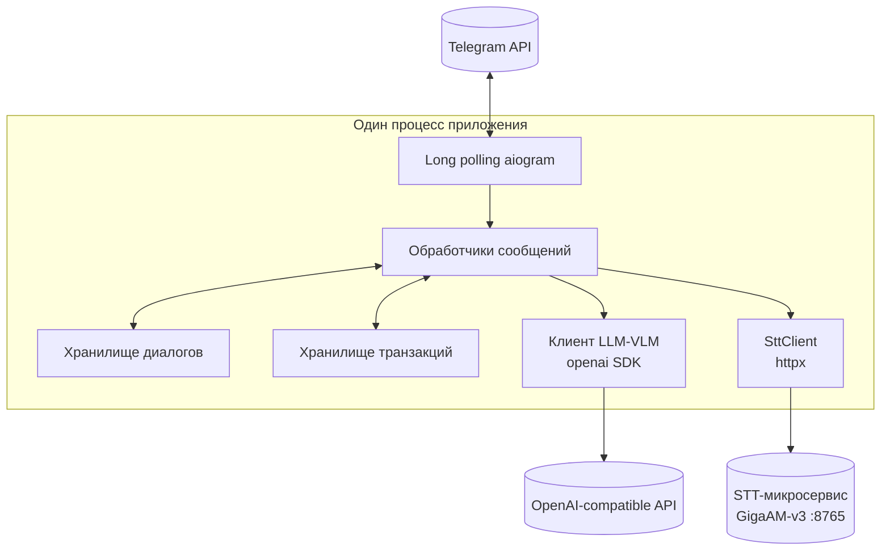

# Техническое видение проекта

Исходная идея продукта: [idea.md](./idea.md).

Документ фиксирует минимальный стек и принципы MVP (проверка гипотезы). Продакшен-сервер и CI/CD в скоуп MVP не входят: достаточно локального запуска и запуска в Docker.

---

## Оглавление (разделы)

1. [Технологии](#1-технологии)
2. [Принципы разработки](#2-принципы-разработки)
3. [Структура проекта](#3-структура-проекта)
4. [Архитектура](#4-архитектура)
5. [Модель данных](#5-модель-данных)
6. [Работа с LLM](#6-работа-с-llm)
7. [Сценарии работы](#7-сценарии-работы)
8. [Конфигурация](#8-конфигурация)
9. [Логирование](#9-логирование)
10. [Сборка и деплой](#10-сборка-и-деплой)

---

## 1. Технологии

| Область | Решение |
|--------|---------|
| Язык | **Python 3.12** — целевая версия для разработки и запуска. |
| Зависимости и окружение | **uv**: синхронизация зависимостей (`uv sync`), виртуальное окружение проекта, фиксация версий через `uv.lock`. |
| LLM | Пакет **openai** (официальный клиент). **OpenAI-совместимый** endpoint (например **OpenRouter** или локальный **Ollama**): базовый URL, модели и ключ задаются конфигурацией (см. §8). |
| Telegram | **aiogram** (ветка 3.x). Получение обновлений: **long polling** (webhook на этапе MVP не используется). |
| Контейнер | **Docker** — один образ приложения для воспроизводимого локального запуска. |
| Сборка и команды | **Make**: `Makefile` с целями для установки зависимостей, запуска бота, сборки/запуска контейнера. **Требование к среде:** установленный `make` без привязки к способу установки (дистрибутив, пакетный менеджер и т.д.). |

**Вне скоупа MVP:** базы данных, брокеры сообщений, отдельный HTTP API, очереди.

---

## 2. Принципы разработки

- **KISS:** реализуем только то, что нужно для Telegram, вызова LLM/VLM и учёта транзакций; без абстракций «на вырост» и без лишних промежуточных слоёв.
- **ООП:** поведение и границы ответственности выражены классами с узкой зоной ответственности.
- **Один класс — один файл** (строго): имя файла согласовано с основным классом в нём.
- **Хранение состояния:** без баз данных; история диалога и список транзакций учёта — в памяти процесса (структуры Python). Перезапуск процесса сбрасывает и переписку, и учёт — для MVP приемлемо.
- **Без оверинжиниринга:** нет универсальных плагинов, шины событий, собственных DI-контейнеров и аналогичных механизмов без явной необходимости.
- **Тесты:** на этапе MVP **опциональны**; достаточно ручной проверки сценариев при необходимости.

---

## 3. Структура проекта

Используется **src layout**: весь код приложения — под `src/`, один устанавливаемый пакет Python. **Имя пакета** (`<package_name>`) задаётся при первичной настройке репозитория (каталог `src/<package_name>/`); в документе допускается плейсхолдер до фиксации имени в коде.

```text
<корень репозитория>/
  docs/
    adr/
      README.md            # индекс ADR
      NNNN-краткое-имя.md  # архитектурные решения (см. раздел «Архитектура»)
    idea.md
    vision.md
  src/
    <package_name>/
      __init__.py
      main.py              # точка входа: запуск polling, минимальная сборка зависимостей
      ...                  # прочие модули — по одному основному классу на файл
  pyproject.toml
  uv.lock
  Makefile
  Dockerfile
  .env.example             # пример переменных окружения без секретов
```

Конфигурация сборки и запуска — в корне (`Makefile`, `Dockerfile`, `pyproject.toml`). Документация и ADR — в `docs/`.

---

## 4. Архитектура

### Поток и роли

**Поток данных (текст):** Telegram (long polling) → обработчики → чтение/запись **истории диалога** в памяти → вызов **LLM** с **structured output** (извлечение транзакции, при необходимости — ответ советника) → запись в **хранилище транзакций** (если извлечена операция) → ответ пользователю.

**Поток данных (фото чека):** обработчик фото → загрузка байтов файла → вызов **VLM** (тот же OpenAI-совместимый клиент, отдельный идентификатор модели) с **structured output** → запись транзакции → подтверждение в чат.

**Поток данных (голосовое сообщение):** обработчик `F.voice` → загрузка байтов `.ogg` → HTTP POST в **STT-микросервис** (`SttClient`, адрес из `STT_BASE_URL`) → транскрибированный текст → далее как текстовый поток (LLM + structured output).

**Отчёт:** команда `/report` → агрегация из **хранилища транзакций** для `chat_id` → ответ текстом без вызова LLM (или при необходимости уточнения — по правилам итерации; по умолчанию без LLM).

| Роль | Назначение |
|------|------------|
| Точка входа | Создаёт объекты, настраивает aiogram (`Bot`, `Dispatcher`), регистрирует обработчики, запускает polling. |
| Обработка Telegram | Обработчики текста, команд, фото и голосовых сообщений; `chat_id`, текст, вложения. |
| Хранение диалогов | В памяти: ключ — `chat_id`, значение — история для Chat Completions. Без персистентности. |
| Хранение транзакций | В памяти: ключ — `chat_id`, значение — список записей учёта (см. §5). Без персистентности. |
| Слой LLM / VLM | Вызовы OpenAI-совместимого API: текст (извлечение + совет) и изображения (чек). Зависит только от сообщений/байтов и схемы ответа, **не** импортирует aiogram. |
| Клиент STT | `SttClient` — async HTTP-клиент к внешнему STT-микросервису (`STT_BASE_URL`). Не импортирует aiogram и не зависит от слоя LLM. |
| STT-микросервис | Отдельный процесс (вне Docker-образа бота) на GPU-сервере: FastAPI + GigaAM-v3. Принимает байты аудио, возвращает текст. |
| Конфигурация | Параметры из переменных окружения (см. §8). |

**Зависимости:** обработчики используют хранилища диалогов и транзакций, слой LLM и клиент STT; слой LLM и `SttClient` не импортируют Telegram и не зависят друг от друга.

**Инфраструктура:** один процесс бота; внешние вызовы — Telegram API, настроенный **LLM backend** (облако или локальный Ollama и т.п.) и **STT-микросервис** (опционально, по `STT_BASE_URL`).

### Схема (логическая)



### Архитектурные решения (ADR)

Нефункциональные и структурные решения фиксируются отдельными записями в каталоге [docs/adr](./adr/README.md): формат короткий (статус, контекст, решение, последствия). Текущий индекс — в `README.md` внутри `adr/`.

---

## 5. Модель данных

Персистентного хранилища нет: все данные живут в **памяти процесса** до перезапуска.

### Диалоги

| Сущность | Описание |
|----------|----------|
| **Ключ сессии** | Идентификатор чата Telegram (`chat_id`), целое число. |
| **Значение** | Список сообщений для передачи в Chat Completions API: элементы с полями роли и текста (`user` / `assistant` — в объёме, достаточном для вызова LLM; системный промпт в запрос не дублируется в этом списке — он задаётся отдельно при сборке запроса, см. раздел про LLM). |
| **Обновление** | При входящем сообщении пользователя: добавить `user`, вызвать LLM, добавить ответ как `assistant`. |
| **Обрезка истории** | Храним не больше **N** последних сообщений **в сумме** (`user` и `assistant` — отдельные элементы списка). **N** задаётся только переменной окружения, например `MAX_HISTORY_MESSAGES`. При превышении лимита удаляются самые старые сообщения. |

### Транзакции (учёт)

**Сущность `Transaction`** (в коде — `dataclass`, поля согласованы с таблицей учёта; сумма — `Decimal`):

```python
@dataclass
class Transaction:
    timestamp: datetime       # дата и время операции
    flow: Literal["income", "expense"]
    amount: Decimal
    tx_type: Literal["everyday", "periodic", "one-time"]
    category: str             # продукты, рестораны, такси, образование, путешествия, …
    description: str          # подробности: товары, услуги, источник, контрагент и т.п.
```

| Сущность | Описание |
|----------|----------|
| **Ключ** | `chat_id` (как для диалогов). |
| **Значение** | Список `Transaction` для данного чата. |
| **Добавление** | После успешного извлечения из текста (LLM + structured output) или из фото (VLM + structured output). |
| **Сброс** | Перезапуск процесса — списки очищаются. |

### Настройки

Все параметры приложения (включая лимит истории, ключи API, URL, модель, системный промпт, параметры логирования) задаются **только** через переменные окружения и файл **`.env`** в корне репозитория для локального запуска. Секреты не коммитятся; полный перечень имён переменных и примеры безопасных заглушек — в разделе [§8 Конфигурация](#8-конфигурация) и в **`.env.example`**.

---

## 6. Работа с LLM

### Клиент и endpoint

- Используется **`openai`** (асинхронный клиент при асинхронном цикле aiogram): **`base_url`** и **`api_key`** задаются переменными **`LLM_BASE_URL`** и **`LLM_API_KEY`** (см. §8). Так поддерживаются **OpenRouter**, локальный **Ollama** (`…/v1`) и другие OpenAI-совместимые сервисы без смены кода.
- Вызов **Chat Completions** (без streaming на этапе MVP): ответ — либо **распарсенная структура** (режим structured output), либо текст (режим «только совет», если в ответе отмечено отсутствие транзакции).

### Structured output (текст → транзакция и ответ)

- Схема ответа описывается через **Pydantic** (например модель **`TransactionExtract`**): поля транзакции по §5 плюс флаг **`found: bool`** (и при необходимости краткий **пользовательский текст** для чата).
- Запрос к API собирается с **`response_format`** (JSON Schema / structured outputs) в объёме, поддерживаемом клиентом и выбранным backend.
- Если **`found` is False** — новая запись в таблицу учёта **не** добавляется; в историю диалога попадает ответ-совет (как сейчас для обычного сообщения) — конкретное единообразие фиксируется в итерации с кодом.
- Если **`found` is True** — в `TransactionStore` добавляется **`Transaction`**, пользователю — краткое подтверждение (дата, величина, категория и т.д.).

### VLM (фото чека → транзакция)

- Файл фото получается через aiogram (**байты**); для API кодируется в **base64** и передаётся в **`content`** как **`image_url`** с префиксом `data:image/jpeg;base64,…` (или фактический MIME).
- Модель задаётся **`VLM_MODEL`** (может совпадать с **`LLM_MODEL`**, например для одной мультимодальной модели в Ollama).
- Промпт инструктирует извлечь из чека дату/время, сумму, тип расхода, категорию, описание; результат — тот же **structured output**, что и для текста, с **`found`** на случай нечитаемого снимка.

### Сборка запроса (текстовый диалог / извлечение)

1. **`system`** — **`SYSTEM_PROMPT`**: роль финансового советника (см. [idea.md](./idea.md) и §8).
2. **История** — `user` / `assistant` из хранилища для `chat_id` (обрезка по `MAX_HISTORY_MESSAGES`).
3. **Новое сообщение** — текст пользователя или мультимодальный контент (текст + изображение для чека без отдельной подписи — по реализации).

Порядок для API: `[system, …история…, user]`.

### Параметры генерации

- **`model`** — для текста: **`LLM_MODEL`**; для изображений: **`VLM_MODEL`**.
- **`temperature`** и лимит токенов — **`LLM_TEMPERATURE`**, **`LLM_MAX_TOKENS`** (и при необходимости отдельные переменные для VLM — только если понадобится; по умолчанию те же).

### Ошибки и ограничения

- Сбои сети или API: пользователю — **короткое нейтральное сообщение**; детали — в логах (см. §9). Не дописывать в историю «битый» ответ ассистента — как в текущем правиле для ошибок.
- Один пользовательский запрос — один вызов извлечения/ответа (без автоматических ретраев с удлинением контекста).

---

## 7. Сценарии работы

| Сценарий | Поведение |
|----------|-----------|
| **Текст: трата или доход** | LLM возвращает structured output; при **`found=True`** — запись в хранилище транзакций и краткое подтверждение в чат (например «Записал: −500 ₽, такси, 10.05»). |
| **Текст: без операции** | **`found=False`** — ответ как у финансового советника, запись не создаётся; история диалога обновляется по правилам итерации. |
| **Фото чека** | VLM + structured output; при успехе — запись транзакции и подтверждение; при нечитаемом чеке — нейтральное сообщение или ответ без записи. |
| **Голосовое сообщение** | Байты `.ogg` → `SttClient.transcribe()` → текст → далее как «Текст: трата или доход» / «без операции». При `STT_BASE_URL` не задан — ответ «Голосовые сообщения не поддерживаются». При сбое STT-сервиса — нейтральное сообщение; бот продолжает работу. |
| **`/report`** | Агрегация по `TransactionStore`: баланс (доходы − расходы), при необходимости суммы по категориям; ответ в чат. По умолчанию **без** вызова LLM. |
| **`/start`** | Короткое приветствие финансового советника **без** вызова LLM; историю и транзакции не очищает (если отдельно не запланирована команда сброса). |
| **Ошибка LLM / VLM / сети** | Нейтральное сообщение в чат; детали в логах; историю не портить «пустым» `assistant`. |
| **Перезапуск процесса** | Теряются и история диалога, и все транзакции в памяти. |

Групповые чаты — **вне скоупа**. **Фото (чеки)** и **голосовые сообщения** — **в скоупе** (итерации 8 и 10 соответственно).

---

## 8. Конфигурация

### Принцип

- Все настройки задаются **переменными окружения**.
- Локально: файл **`.env`** в корне репозитория (не коммитится); в репозитории хранится только **`.env.example`** с теми же именами переменных и безопасными примерами/заглушками.
- В Docker: те же переменные передаются в контейнер (`env_file` и/или `-e`), без дублирования логики чтения конфигурации.

Загрузку `.env` выполняет приложение при старте (например через `python-dotenv`), чтобы не зависеть от shell-оболочки.

### Перечень переменных (MVP)

Все перечисленные ниже переменные **должны** быть заданы в окружении или в `.env` перед запуском (в `.env.example` — те же имена и примеры значений / заглушек):

| Переменная | Назначение |
|------------|------------|
| `TELEGRAM_BOT_TOKEN` | Токен бота от BotFather. |
| `LLM_BASE_URL` | Базовый URL OpenAI-совместимого API: например `https://openrouter.ai/api/v1` или `http://<хост>:11434/v1` для **Ollama**. |
| `LLM_API_KEY` | Ключ доступа к API. Для OpenRouter — реальный ключ; для Ollama часто достаточно произвольной строки (например `ollama`), если сервер так настроен. |
| `LLM_MODEL` | Идентификатор текстовой (или универсальной) модели на выбранном backend. |
| `VLM_MODEL` | Модель для обработки изображений чеков; может совпадать с `LLM_MODEL` на Ollama. |
| `SYSTEM_PROMPT` | Системный промпт: роль **персонального финансового советника** и правила учёта. Многострочность — в кавычках или экранирование по правилам `.env`. |
| `MAX_HISTORY_MESSAGES` | Максимум сообщений `user`+`assistant` в истории на один чат (см. §5). |
| `LOG_LEVEL` | Уровень логирования, например `INFO` или `DEBUG`. |
| `LLM_TEMPERATURE` | Температура генерации. |
| `LLM_MAX_TOKENS` | Верхняя граница токенов ответа. |
| `STT_BASE_URL` | *(опционально)* Базовый URL STT-микросервиса GigaAM-v3, например `http://<хост>:8765`. Если не задан — голосовые сообщения отклоняются с понятным ответом пользователю. |

**Переключение backend через `.env` (без смены кода):**

- **OpenRouter:** `LLM_BASE_URL=https://openrouter.ai/api/v1`, `LLM_API_KEY=<ключ OpenRouter>`, модели — по каталогу провайдера.
- **Локальный Ollama** (в т.ч. на GPU-сервере): `LLM_BASE_URL=http://<хост>:11434/v1`, `LLM_API_KEY=ollama` (или иное значение по настройке сервера), `LLM_MODEL` / `VLM_MODEL` — имена загруженных моделей.
- **STT (голос):** `STT_BASE_URL=http://<хост>:8765` — адрес задеплоенного GigaAM-v3 микросервиса; при отсутствии переменной голосовые сообщения не обрабатываются.

Имена зафиксированы здесь и повторяются в `.env.example` при добавлении кода.

---

## 9. Логирование

### Подход

- Стандартный модуль **`logging`** (без сторонних лог-фреймворков).
- Уровень задаётся **`LOG_LEVEL`** из окружения (см. §8): достаточно поддержки типичных значений (`DEBUG`, `INFO`, `WARNING`, `ERROR`).
- Вывод — в **поток stderr** (удобно для Docker и перенаправления в консоль/файл средствами ОС).

### Формат

- Одна запись на строку, без JSON-обязательства для MVP: **время**, **уровень**, **имя логгера**, **сообщение** (например через `logging.Formatter`, единый базовый конфиг при старте приложения).

### Что не логировать

- Токены (`TELEGRAM_BOT_TOKEN`, `LLM_API_KEY`), полные тексты `.env`.
- По возможности не логировать дословно длинные пользовательские сообщения на `INFO`; детали запросов к LLM — только на `DEBUG` и без ключей.

Ошибки вызовов Telegram / LLM API — с уровнем **`ERROR`** (или **`WARNING`** для ожидаемых сбоев сети — на усмотрение реализации, но единообразно в коде).

---

## 10. Сборка и деплой

### Локально без Docker

- **Зависимости:** `uv sync` (или цель `Makefile`, вызывающая `uv sync`).
- **Запуск бота:** `uv run` с указанием модуля точки входа пакета (например `uv run python -m <package_name>` после выбора имени пакета), либо эквивалентная цель `make run`.
- Требования: установленные **Python 3.12**, **uv**, **make** при использовании `Makefile`.

### Локально с Docker

- **Dockerfile** в корне: образ на базе официального **Python 3.12** (slim — для меньшего размера), установка зависимостей через **uv** в образе, копирование `src/` и метаданных проекта.
- Запуск контейнера с **`env_file: .env`** (или `--env-file`) и теми же переменными, что в §8; `.env` не вкладывается в образ.
- Цели **`make docker-build`** / **`make docker-run`** (или одна цель, которая собирает и запускает) — имена согласовать в `Makefile` при реализации.

### Деплой

- Внешний сервер, оркестраторы и **CI/CD для MVP не требуются**; достаточно возможности запустить бота локально или в Docker на машине разработчика для проверки идеи. Перенос на VPS/облако — отдельный этап после MVP.

---
