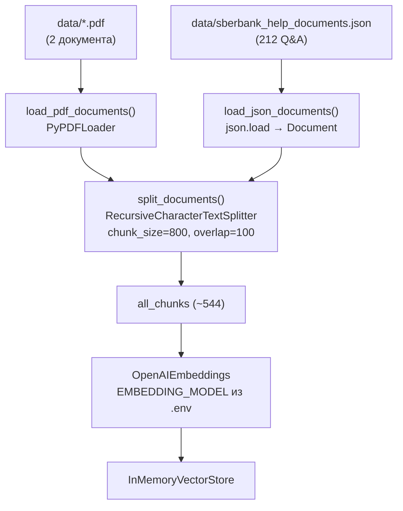
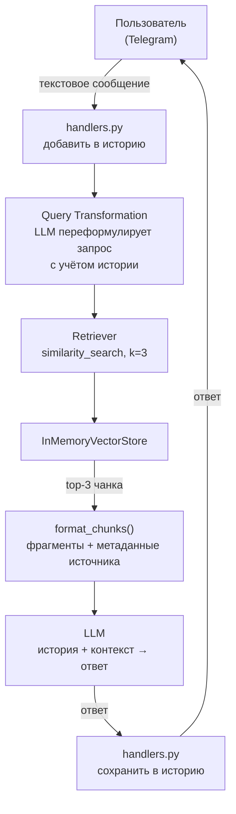

# RAG-ассистент Сбербанка

Telegram-бот с RAG (Retrieval-Augmented Generation) для ответов на вопросы по документам Сбербанка о кредитах и вкладах.

## ✨ Возможности

- 🤖 **RAG на базе LangChain** - ответы на основе реальных документов
- 📚 **Индексация PDF + JSON** - автоматическая обработка PDF-документов и JSON FAQ при старте
- 💬 **Контекстный диалог** - понимание уточняющих вопросов
- 🔍 **Query Transformation** - улучшение поисковых запросов с учетом истории
- ⚡ **Асинхронная обработка** - поддержка множества пользователей одновременно
- 📝 **Логирование** - запись всех событий в файл для отладки

## 🚀 Быстрый старт

### Требования

- Python 3.11+
- [uv](https://github.com/astral-sh/uv) - менеджер зависимостей

### Установка

1. Клонируйте репозиторий:
   ```bash
   git clone <repository-url>
   cd telegram-llm-bot
   ```

2. Установите зависимости:
   ```bash
   make install
   ```

3. Настройте переменные окружения:
   ```bash
   cp env.example .env
   ```

4. Отредактируйте `.env` (см. раздел "Конфигурация")

5. Запустите бота:
   ```bash
   make run
   ```

## ⚙️ Конфигурация

### Получение токенов

**Telegram Bot Token:**
1. Найдите @BotFather в Telegram
2. Отправьте `/newbot` и следуйте инструкциям
3. Скопируйте токен

**API ключ провайдера:**

Бот использует **OpenRouter** (OpenAI-совместимый API) для LLM и эмбеддингов.

1. Зарегистрируйтесь на [OpenRouter.ai](https://openrouter.ai/)
2. Перейдите в раздел API Keys и создайте ключ

Бот поддерживает любую OpenAI-совместимую модель эмбеддингов OpenRouter. Проверенные варианты: `openai/text-embedding-3-large` (baseline), `baai/bge-m3`, `qwen/qwen3-embedding-8b` — меняется только `EMBEDDING_MODEL` в `.env`.

### Пример конфигурации (.env)

```bash
# Telegram
TELEGRAM_TOKEN=your_telegram_bot_token

# OpenRouter
OPENAI_API_KEY=sk-or-v1-...
OPENAI_BASE_URL=https://openrouter.ai/api/v1
MODEL=openai/gpt-oss-20b:free
MODEL_QUERY_TRANSFORM=openai/gpt-oss-20b:free
EMBEDDING_MODEL=openai/text-embedding-3-large

# Пути
DATA_DIR=data
PROMPTS_DIR=prompts
CONVERSATION_SYSTEM_PROMPT_FILE=conversation_system.txt
QUERY_TRANSFORM_PROMPT_FILE=query_transform.txt

# Системный промпт
SYSTEM_PROMPT=Ты ассистент Сбербанка, отвечающий на вопросы по документам.
```

### Описание параметров

**Обязательные:**
- `TELEGRAM_TOKEN` - токен бота от @BotFather
- `OPENAI_API_KEY` - API ключ от выбранного провайдера
- `OPENAI_BASE_URL` - URL API провайдера

**Модели:**
- `MODEL` - модель для генерации ответов (основная LLM)
- `MODEL_QUERY_TRANSFORM` - модель для трансформации запросов
- `EMBEDDING_MODEL` - модель для создания эмбеддингов документов

**Пути:**
- `DATA_DIR` - директория с PDF документами (по умолчанию: `data`)
- `PROMPTS_DIR` - директория с файлами промптов (по умолчанию: `prompts`)
- `CONVERSATION_SYSTEM_PROMPT_FILE` - файл промпта для диалога
- `QUERY_TRANSFORM_PROMPT_FILE` - файл промпта для трансформации запросов

**Промпты:**
- `SYSTEM_PROMPT` - системная инструкция для бота

## 📚 Добавление документов

1. Поместите PDF файлы в директорию `data/`
2. Убедитесь, что в `data/` лежит `sberbank_help_documents.json` (FAQ по картам — уже включён)
3. Перезапустите бота (документы проиндексируются автоматически)
   
   ИЛИ
   
4. Используйте команду `/index` в Telegram для переиндексации без перезапуска

**Примечание:** Бот автоматически через `indexer_with_json.py`:
- Загружает все PDF из `data/` и JSON FAQ
- Разбивает на чанки (`chunk_size=800`, `chunk_overlap=100`)
- Создает векторные эмбеддинги
- Сохраняет в памяти для быстрого поиска (~544 чанка для текущего набора данных)

## 💬 Использование

### Команды бота

- `/start` - Начать новый диалог (сбросить историю)
- `/help` - Показать справку
- `/index` - Переиндексировать документы
- `/index_status` - Проверить статус индексации

### Примеры диалогов

**Простой вопрос:**
```
👤 Какие условия потребительского кредита?
🤖 По документу, потребительский кредит предоставляется на сумму от 30 000 до 5 000 000 рублей, 
   на срок от 3 месяцев до 5 лет. Процентная ставка зависит от категории заемщика и составляет 
   от 12.9% до 19.9% годовых.
```

**Уточняющий вопрос:**
```
👤 Какие вклады есть в Сбербанке?
🤖 В документах указаны следующие виды вкладов: "Пополняй", "Управляй", "Сохраняй"...

👤 А какие проценты по вкладу "Сохраняй"?
🤖 По вкладу "Сохраняй" процентная ставка составляет от 4% до 6% годовых в зависимости 
   от суммы и срока вклада...
```

**Вопрос вне контекста:**
```
👤 Какая погода сегодня?
🤖 Я не нашел ответа на ваш вопрос в доступных документах.
```

## 🏗️ Архитектура

### Структура проекта

```
├── src/
│   ├── bot.py                  # Точка входа, инициализация, логирование
│   ├── config.py               # Загрузка конфигурации из .env
│   ├── handlers.py             # Обработчики команд и сообщений
│   ├── indexer.py              # Базовая индексация PDF
│   ├── indexer_with_json.py    # Объединённая индексация PDF + JSON (активный)
│   └── rag.py                  # RAG-логика: retriever, цепочки, промпты
├── prompts/
│   ├── conversation_system.txt    # Промпт для диалога
│   └── query_transform.txt        # Промпт для трансформации запросов
├── data/
│   ├── ouk_potrebitelskiy_kredit_lph.pdf
│   ├── usl_r_vkladov.pdf
│   └── sberbank_help_documents.json   # FAQ по картам (212 Q&A)
├── scripts/
│   └── hw3_compare_embeddings.py      # Сравнение моделей эмбеддингов
├── logs/               # Логи работы бота
├── .env                # Конфигурация (не в git)
├── env.example         # Пример конфигурации
├── Makefile            # Команды для работы
├── pyproject.toml      # Зависимости
└── README.md           # Документация
```

### Как работает RAG

#### Индексация (при старте бота)



#### Обработка вопроса пользователя



### Технологический стек

- **aiogram 3.x** - Telegram Bot API
- **LangChain** - фреймворк для RAG
- **LangChain OpenAI** - интеграция с OpenAI-совместимыми API
- **PyPDF** - парсинг PDF документов
- **InMemoryVectorStore** - векторное хранилище в памяти

## 🔧 Разработка

### Команды Makefile

```bash
make install    # Установить зависимости
make run        # Запустить бота
```

### Редактирование промптов

Промпты находятся в `prompts/` и могут редактироваться без изменения кода:

**`prompts/conversation_system.txt`** - как бот отвечает на вопросы:
```
Ты ассистент Сбербанка для ответов на вопросы. Отвечай на вопросы пользователей 
на основе истории диалога и контекста, полученного для последнего вопроса. 

Если в контексте нет информации для ответа, строго отвечай: 
"Я не нашел ответа на ваш вопрос в доступных документах."

Используй максимум 3-4 предложения и давай конкретные ответы.
```

**`prompts/query_transform.txt`** - как трансформируются уточняющие вопросы:
```
Преобразуй последнее сообщение пользователя в поисковый запрос на русском языке, 
учитывая всю историю диалога выше. Тщательно проанализируй все сообщения для 
создания максимально релевантного запроса.
```

### Логи

Логи записываются в `logs/bot.log` и дублируются в консоль.

**Логируются:**
- Старт/остановка бота
- Процесс индексации документов
- Входящие сообщения от пользователей
- Ошибки и исключения

**Пример лога:**
```
2025-11-07 18:32:37,399 - __main__ - INFO - Starting indexing...
2025-11-07 18:32:38,100 - indexer_with_json - INFO - Loaded 212 JSON documents from sberbank_help_documents.json
2025-11-07 18:32:38,384 - indexer - INFO - Split into 544 chunks
2025-11-07 18:32:41,314 - indexer - INFO - Created vector store with 544 chunks
2025-11-07 18:32:41,314 - __main__ - INFO - Indexing completed successfully: 544 documents indexed
```

### Настройка параметров RAG

В `src/indexer.py` и `.env` можно настроить:

- **Размер чанков**: `chunk_size=800` в `RecursiveCharacterTextSplitter` (проверено в HW-1: оптимум)
- **Перекрытие чанков**: `chunk_overlap=100`
- **Количество чанков для поиска**: `RETRIEVER_K=3` в `.env`
- **Temperature** для LLM: `temperature=0.9` в `rag.py`
- **Модель эмбеддингов**: `EMBEDDING_MODEL` в `.env` (см. варианты в `env.example`)

## ⚠️ Ограничения

- История хранится в памяти (теряется при перезапуске)
- Векторное хранилище в памяти (требует переиндексации после перезапуска)
- Только текстовые сообщения (нет поддержки фото, файлов, голосовых)
- Ответы основаны только на проиндексированных документах
- При большом количестве документов может требоваться больше памяти

## 🐛 Устранение неполадок

**Проблема: Бот не отвечает на вопросы**
- Проверьте `/index_status` - должны быть проиндексированы документы
- Убедитесь, что PDF файлы находятся в `data/`
- Проверьте логи в `logs/bot.log`

**Проблема: Ошибка при индексации**
- Проверьте корректность `EMBEDDING_MODEL` для вашего провайдера
- Убедитесь, что API ключ валиден и имеет доступ к embeddings

**Проблема: Бот отвечает "Я не нашел ответа" на все вопросы**
- Возможно, вопросы не связаны с содержимым документов
- Попробуйте задать более конкретные вопросы по тематике документов
- Проверьте, что индексация прошла успешно (`/index_status`)

## 📄 Отчёт по домашнему заданию

Подробный отчёт об экспериментах (чанкинг, JSON-индексация, сравнение эмбеддингов) — в файле [report.md](report.md).

## 📝 Лицензия

MIT
